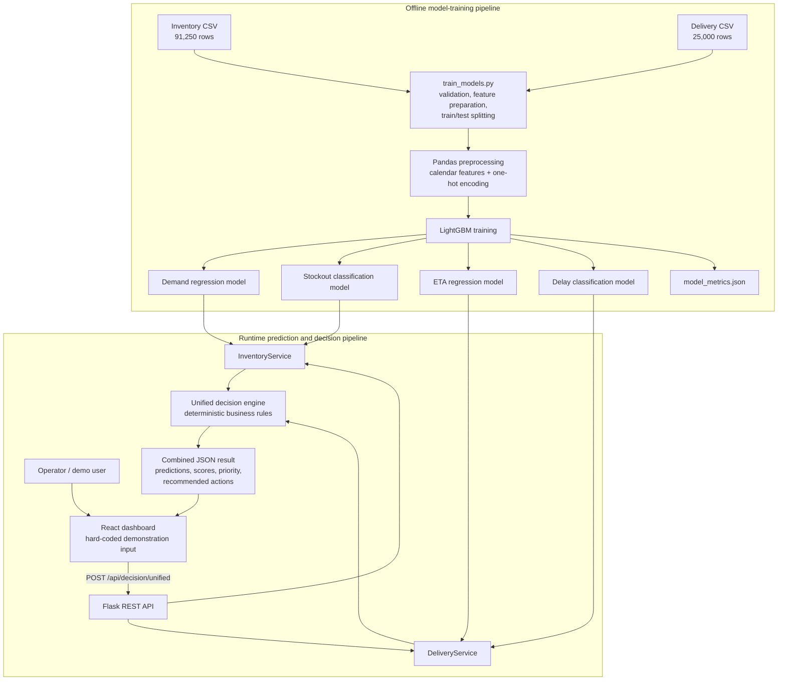
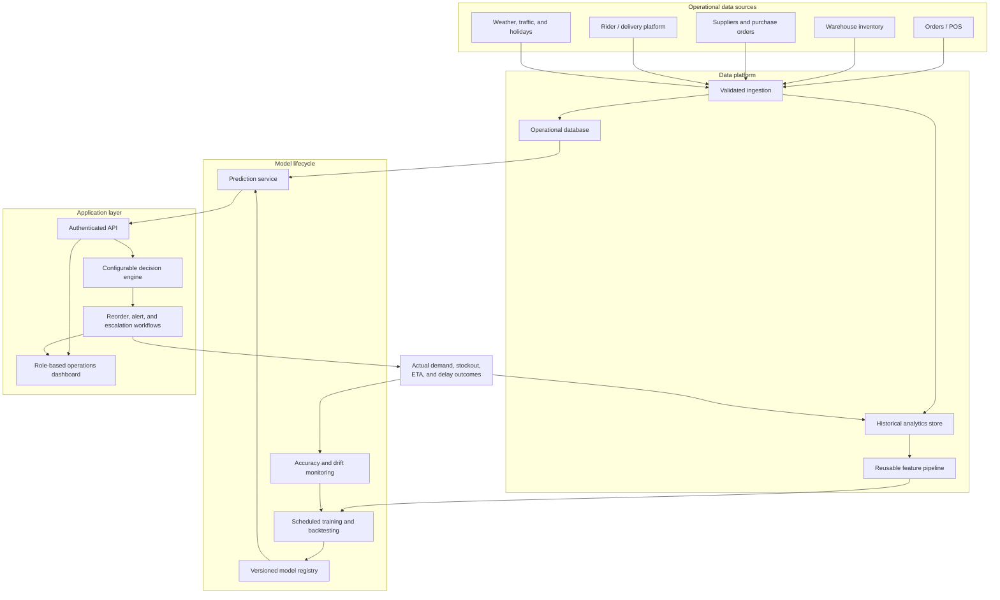

# AI-Based Unified Inventory and Last-Mile Delivery Intelligence Platform for Quick Commerce

Software Design and Development Project — Final Year Project 1

## Project overview

This repository contains a proof-of-concept decision-support platform for quick-commerce operations. It connects inventory intelligence with last-mile delivery intelligence so an operator can evaluate the assigned warehouse, forecast demand, identify stockout and delivery risks, and receive one combined operational recommendation.

The current implementation contains four LightGBM models:

1. Inventory demand regression.
2. Inventory stockout-risk classification.
3. Delivery ETA regression.
4. Delivery-delay classification.

LightGBM is the only machine-learning algorithm used. Inventory health, reorder quantity, delivery cost, rider performance, intelligence scores, priorities, and recommended actions are transparent business rules rather than additional ML models.

## Purpose

The platform is designed to help quick-commerce operators answer the following questions:

- What is the expected daily demand for a product?
- Is the assigned warehouse likely to run out of stock?
- Should stock be reordered, and what quantity is recommended?
- How long is a delivery expected to take?
- What is the probability that the delivery will be delayed?
- Should the delivery be monitored or escalated?
- What is the combined operational priority when inventory and delivery risks are considered together?

The current decision policy evaluates only the warehouse already assigned to an order. It does not automatically search for or transfer the order to another warehouse.

## Scope

### Implemented

- Offline training of four LightGBM models from the included CSV datasets.
- Consistent categorical encoding for training and inference.
- Single-record inventory prediction.
- Single-record delivery prediction.
- Rule-based reorder, health, cost, score, and escalation calculations.
- A unified decision endpoint combining inventory and optional delivery results.
- A Flask REST API.
- A React demonstration dashboard.
- Stored model artifacts and evaluation metrics.

### Not implemented yet

- Operational database or warehouse-management-system integration.
- Live order, inventory, GPS, weather, or traffic feeds.
- User authentication and role-based authorization.
- Persistent prediction or decision history.
- Purchase-order creation or supplier integration.
- Warehouse reassignment, stock transfer, rider assignment, or route optimization.
- Customer notification delivery.
- Batch prediction endpoints.
- Automated retraining, model registry, drift detection, or production deployment.

## Current system architecture



The project has two distinct lifecycles:

- **Training:** CSV data is processed manually to create four version-independent `.joblib` artifacts and a metrics report.
- **Inference:** Flask loads those artifacts and evaluates one submitted inventory/delivery record at a time.

## Project structure

```text
data/raw/                 Source inventory and delivery CSV datasets
data/processed/           Optional generated training-ready data
models/                   Trained LightGBM .joblib artifacts
reports/                  Model evaluation metrics and data notes
src/train_models.py       End-to-end training pipeline
src/utils/modeling.py     Shared preprocessing and LightGBM artifact wrapper
src/inventory/            Inventory inference and business rules
src/delivery/             Delivery inference and business rules
src/decision_engine/      Unified operational recommendation rules
src/api/                  Flask API
frontend/                 React and Vite demonstration dashboard
```

## Data

### Inventory dataset

`data/raw/supply_chain_dataset1.csv` contains:

- 91,250 daily records covering January 1 to December 30, 2024.
- 50 SKUs, 5 warehouses, 10 suppliers, and 4 regions.
- Product, warehouse, supplier, inventory, sales, lead-time, reorder, pricing, and promotion fields.

Important decisions:

- `Units_Sold` is the demand-model target.
- The existing `Demand_Forecast` field is excluded, preventing the model from copying a supplied forecast.
- The supplied `Stockout_Flag` is always `0` and cannot train a classifier.
- A derived historical stockout-risk target is therefore used:

```text
Inventory_Level < Units_Sold × Supplier_Lead_Time_Days × 1.15
```

The `1.15` multiplier represents a 15% safety-stock buffer. This rule creates 6,499 positive risk rows, approximately 7.1% of the inventory dataset. `Units_Sold` is not provided to the stockout classifier as an input feature.

### Delivery dataset

`data/raw/Quick_Commerce_Delivery_Logistics.csv` contains:

- 25,000 delivery records.
- 9 delivery partners and 5 regions.
- 6,669 delayed deliveries, approximately 26.7% of the dataset.
- Partner, package, vehicle, mode, region, weather, distance, weight, expected-time, rating, traffic, peak-hour, and rider-workload information.

The following outcome or derived fields are excluded from model inputs to reduce target leakage: `delivery_time_minutes`, `delivery_status`, `ETA_Minutes`, `Delay_Risk`, and `Delivery_Intelligence_Score`.

## Model implementation

All models use LightGBM with 300 estimators, a learning rate of `0.05`, 31 leaves, and a random state of `42`.

| Model | Task | Target | Reported result |
|---|---|---|---|
| Inventory demand | Regression | `Units_Sold` | MAE 5.9482; RMSE 7.3956 |
| Inventory stockout | Binary classification | Derived stockout-risk label | Accuracy 96.30%; ROC AUC 0.9828 |
| Delivery ETA | Regression | `delivery_time_minutes` | MAE 3.267 minutes; RMSE 3.7885 minutes |
| Delivery delay | Binary classification | `delayed` | Accuracy 91.92%; ROC AUC 0.9767 |

Inventory demand uses the latest 20% of date-sorted rows as the test set. The remaining models currently use a random 80/20 split; classification is stratified when possible.

### Feature preparation

- Text and categorical values are converted using Pandas one-hot encoding.
- Inventory `Date` is converted into `year`, `month`, and `day_of_week`.
- Each saved artifact stores its raw and encoded feature lists.
- Inference data is reindexed against the stored encoded columns, keeping training and prediction shapes consistent.
- Missing required fields cause a validation error.

## Inventory intelligence

The inventory service predicts daily demand and stockout probability, then applies the following rules.

### Required stock

```text
required_stock = predicted_daily_demand × supplier_lead_time × 1.15
```

### Recommended reorder quantity

```text
recommended_reorder_quantity = max(0, ceil(required_stock - current_inventory))
```

A reorder is requested when either:

- Current inventory is at or below `Reorder_Point`, or
- Stockout probability is at least 70%.

Risk labels are:

- Low: below 35%.
- Medium: 35% to below 70%.
- High: 70% or above.

The inventory-health score starts at 100 and is reduced by stockout probability and the shortage relative to required stock. Its labels are `Healthy` at 70 or above, `Moderate` from 40 to below 70, and `Critical` below 40.

## Delivery intelligence

The delivery service predicts ETA and delay probability. It then calculates transparent operational values.

### Estimated delivery cost

```text
base cost          = 20
distance cost      = distance_km × 7
weight cost        = package_weight_kg × 2
traffic adjustment = 0, 8, or 18
vehicle adjustment = 0, 2, or 4
```

This cost calculation is a business rule rather than an ML prediction.

The rider-performance and delivery-intelligence scores combine delivery rating, delay probability, predicted ETA, and expected time. Recommendations use the same Low, Medium, and High probability thresholds as the inventory service.

## Unified decision engine

The decision engine combines the two service results without training another model.

| Condition | Result |
|---|---|
| Stockout probability at least 70% | Critical priority; mark the item unavailable at the assigned warehouse and create an urgent supplier reorder |
| Reorder required with stockout probability below 70% | High priority; create a reorder for the assigned warehouse |
| Delivery delay probability at least 70% | High priority, or Critical when combined with an inventory problem; notify the customer and prioritize rider support |
| Delivery delay probability from 35% to below 70% | Monitor delivery and prepare an ETA update |
| No actionable risk | Continue normal inventory and delivery monitoring |

The response always includes `assigned_warehouse_only: true`. The current system never selects another warehouse.

## API

| Method | Route | Purpose |
|---|---|---|
| `GET` | `/health` | Service health and algorithm information |
| `POST` | `/api/inventory/predict` | Inventory prediction and inventory rules |
| `POST` | `/api/delivery/predict` | Delivery prediction and delivery rules |
| `POST` | `/api/decision/unified` | Inventory, optional delivery, and unified decision |

The model services are initialized lazily on their first request.

### Example inventory request

```json
{
  "Date": "2024-01-01",
  "SKU_ID": "SKU_1",
  "Warehouse_ID": "WH_1",
  "Supplier_ID": "SUP_8",
  "Region": "West",
  "Inventory_Level": 592,
  "Supplier_Lead_Time_Days": 14,
  "Reorder_Point": 379,
  "Order_Quantity": 0,
  "Unit_Cost": 13.95,
  "Unit_Price": 20.48,
  "Promotion_Flag": 0
}
```

## Frontend

The React dashboard currently provides one **Run demo decision** action. It sends hard-coded inventory and delivery examples to the unified endpoint and displays inventory, delivery, and combined-decision cards.

It is a demonstration interface. It does not yet provide editable inputs, warehouse or SKU selection, record history, filtering, authentication, or operational workflow actions.

## Running the project in VS Code

### Prerequisites

- Python 3.10 or newer from python.org.
- Node.js and npm.

Verify Python before creating the environment:

```powershell
python --version
```

Create and activate a virtual environment, install dependencies, and train the models:

```powershell
python -m venv .venv
.\.venv\Scripts\Activate.ps1
pip install -r requirements.txt
python -m src.train_models
```

Start the Flask API:

```powershell
python -m flask --app src.api.app run --debug
```

Confirm the API at `http://127.0.0.1:5000/health`.

In a second terminal, start the dashboard:

```powershell
cd frontend
npm install
npm run dev
```

## Current maturity and limitations

This repository should be treated as **Version 0: an offline-trained, single-record prediction prototype with a demonstration UI**.

Important limitations include:

1. **Demand forecasting is currently tabular prediction.** It does not use lagged sales, rolling demand, holidays, pending purchase orders, or richer time-series signals.
2. **The stockout target is synthetic.** The classifier learns a label derived from a formula rather than actual fulfilment failures or lost sales.
3. **Accuracy alone is insufficient for the imbalanced stockout target.** Precision, recall, F1, confusion matrices, and probability calibration should be added.
4. **`delivery_rating` may be unavailable before delivery.** If it is collected after completion, it should be removed or replaced by a historical rider/partner rating.
5. **The reorder decision and quantity can conflict.** Inventory below the reorder point can trigger a reorder while the calculated quantity remains zero.
6. **Evaluation uses a single split.** There is no multi-period backtesting, cross-validation, external validation, or business-impact simulation.
7. **API validation is basic.** There are no typed request schemas, detailed range checks, authentication, rate limiting, or restricted CORS.
8. **No automated tests are included.** Unit, API, integration, frontend, and data-quality tests still need to be added.
9. **There is no feedback loop.** Predictions, actions, and actual outcomes are not persisted for later evaluation or retraining.

## Future architecture



## Recommended roadmap

### Phase 1 — Reproducible baseline

- Pin dependency versions.
- Verify all four artifacts can be loaded in a fresh environment.
- Correct and verify development and production frontend scripts.
- Add typed API schemas and consistent error responses.
- Add unit and API smoke tests.
- Record model-training metadata and package versions.

### Phase 2 — Model validity

- Add lagged demand, rolling averages, trends, holidays, and promotion history.
- Replace the derived stockout label with real operational outcomes when available.
- Verify whether delivery rating is a legitimate pre-delivery feature.
- Use time-based backtesting where appropriate.
- Add precision, recall, F1, calibration, and segment-level evaluation.
- Tune action thresholds using operational costs.

### Phase 3 — Usable application

- Replace hard-coded examples with validated input forms.
- Add SKU, warehouse, order, and delivery selection.
- Explain the factors and rules behind each recommendation.
- Add batch input, risk queues, decision history, and user overrides.
- Persist predictions, actions, and outcomes.

### Phase 4 — Operational integration

- Connect order, inventory, supplier, and delivery systems.
- Create purchase-order drafts and alert workflows.
- Integrate customer ETA notifications and rider-support escalation.
- Add warehouse-transfer logic only if the assigned-warehouse policy changes.

### Phase 5 — Production and MLOps

- Add authentication, authorization, configuration management, and restricted CORS.
- Containerize and deploy the services.
- Add CI/CD, structured logging, tracing, and monitoring.
- Version models and support rollback.
- Monitor data quality, drift, prediction accuracy, and business outcomes.
- Retrain only when sufficient validated outcome data is available.

## Reference point for continued development

The next recommended milestone is:

> **Version 1: a reproducible and tested local application where users can enter inventory and delivery data, receive validated predictions, and save the resulting operational decision.**

Development should first stabilize the existing pipeline and its tests, then improve model validity, then add operational integrations. This preserves the current working proof of concept as a clear baseline while the platform grows.
