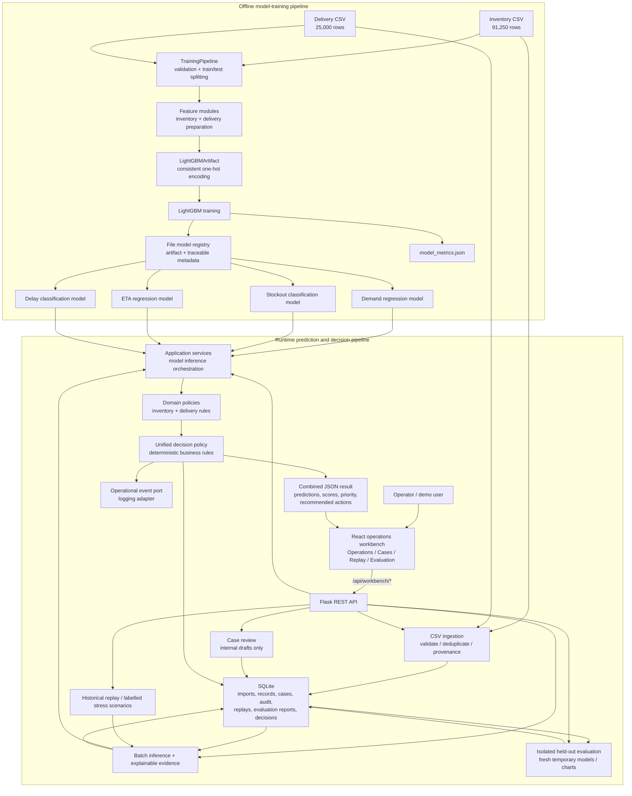
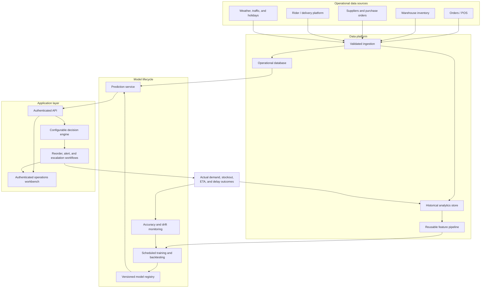

# AI-Based Unified Inventory and Last-Mile Delivery Intelligence Platform for Quick Commerce

Software Design and Development Project — Final Year Project 1

## Project overview

The operations-workbench upgrade is implemented in six dependent feature branches,
with one commit and PR per phase. The changes are not merged into `main` yet. See
[implementation phases](docs/implementation-phases.md) for scope and merge order,
and the [workbench guide](docs/workbench-guide.md) for a review/demo walkthrough.
The workbench data API can import local datasets with `POST /api/workbench/imports/inventory`
or `/delivery`, or accept a multipart UTF-8 CSV in the `file` field. Import reports include
accepted/rejected counts, SHA-256 provenance, and deduplication. Browse imported records at
`GET /api/workbench/records/inventory?limit=50&offset=0` and list imports at
`GET /api/workbench/imports`. Outcome columns are stored separately from prediction inputs.
The two source datasets are independent and are never automatically joined as real orders.

This repository contains a proof-of-concept decision-support platform for quick-commerce operations. It connects inventory intelligence with last-mile delivery intelligence so an operator can evaluate the assigned warehouse, forecast demand, identify stockout and delivery risks, and receive one combined operational recommendation.

The current implementation contains four LightGBM models:

1. Inventory demand regression.
2. Inventory stockout-risk classification.
3. Delivery ETA regression.
4. Delivery-delay classification.

LightGBM is the only machine-learning algorithm used. Inventory health, reorder quantity, delivery cost, rider performance, intelligence scores, priorities, and recommended actions are transparent business rules rather than additional ML models.

## Purpose

The platform is designed to help quick-commerce operators answer the following questions:

- What is the expected daily demand for a product?
- Is the assigned warehouse likely to run out of stock?
- Should stock be reordered, and what quantity is recommended?
- How long is a delivery expected to take?
- What is the probability that the delivery will be delayed?
- Should the delivery be monitored or escalated?
- What is the combined operational priority when inventory and delivery risks are considered together?

The current decision policy evaluates only the warehouse already assigned to an order. It does not automatically search for or transfer the order to another warehouse.

## Scope

### Implemented

- Offline training of four LightGBM models from separately obtained CSV datasets.
- Consistent categorical encoding for training and inference.
- Single-record inventory prediction.
- Single-record delivery prediction.
- Rule-based reorder, health, cost, score, and escalation calculations.
- A unified decision endpoint combining inventory and optional delivery results.
- A Flask REST API.
- Validated, deduplicated CSV imports and stored, automatically retrieved inputs.
- Batch analysis with per-record failures, model identities and native feature contributions.
- Persisted priority cases, internal action drafts and audited approval/dismissal.
- Step-by-step or automatic historical replay and four labelled stress scenarios.
- Three held-out evaluation windows/splits per dataset with chart-ready evidence.
- A responsive React operations workbench: Operations, Cases, Replay and Evaluation.
- Checksum-pinned external datasets/model artifacts and tracked evaluation metrics.

### Not implemented yet

- Warehouse-management-system integration.
- Live order, inventory, GPS, weather, or traffic feeds.
- User authentication and role-based authorization.
- Purchase-order creation or supplier integration.
- Warehouse reassignment, stock transfer, rider assignment, or route optimization.
- Customer notification delivery.
- Automated retraining, a configured remote artifact store, drift detection, or production deployment.

## Current system architecture


```mermaid
flowchart TB
    subgraph Training["Offline model-training pipeline"]
        ICSV["Inventory CSV<br/>91,250 rows"]
        DCSV["Delivery CSV<br/>25,000 rows"]
        TRAIN["TrainingPipeline<br/>validation + train/test splitting"]
        FEATURES["Feature modules<br/>inventory + delivery preparation"]
        ENCODE["LightGBMArtifact<br/>consistent one-hot encoding"]
        LGBM["LightGBM training"]
        REGISTRY["File model registry<br/>artifact + traceable metadata"]
        DM["Demand regression model"]
        SM["Stockout classification model"]
        EM["ETA regression model"]
        LM["Delay classification model"]
        METRICS["model_metrics.json"]

        ICSV --> TRAIN
        DCSV --> TRAIN
        TRAIN --> FEATURES --> ENCODE --> LGBM
        LGBM --> REGISTRY
        REGISTRY --> DM
        REGISTRY --> SM
        REGISTRY --> EM
        REGISTRY --> LM
        LGBM --> METRICS
    end

    subgraph Runtime["Runtime prediction and decision pipeline"]
        USER["Operator / demo user"]
        REACT["React operations workbench<br/>Operations / Cases / Replay / Evaluation"]
        API["Flask REST API"]
        APP["Application services<br/>model inference orchestration"]
        DOMAIN["Domain policies<br/>inventory + delivery rules"]
        RULES["Unified decision policy<br/>deterministic business rules"]
        DB["SQLite<br/>imports, records, cases, audit,<br/>replays, evaluation reports, decisions"]
        INGEST["CSV ingestion<br/>validate / deduplicate / provenance"]
        BATCH["Batch inference + explainable evidence"]
        REPLAY["Historical replay / labelled stress scenarios"]
        REVIEW["Case review<br/>internal drafts only"]
        EVAL["Isolated held-out evaluation<br/>fresh temporary models / charts"]
        EVENTS["Operational event port<br/>logging adapter"]
        RESPONSE["Combined JSON result<br/>predictions, scores, priority,<br/>recommended actions"]

        USER --> REACT
        REACT -->|"/api/workbench/*"| API
        ICSV --> INGEST
        DCSV --> INGEST
        API --> INGEST --> DB
        API --> BATCH --> APP
        DB --> BATCH
        API --> REPLAY --> BATCH
        BATCH --> DB
        API --> REVIEW --> DB
        DB --> EVAL
        API --> EVAL --> DB
        API --> APP
        DM --> APP
        SM --> APP
        EM --> APP
        LM --> APP
        APP --> DOMAIN
        DOMAIN --> RULES
        RULES --> DB
        RULES --> EVENTS
        RULES --> RESPONSE
        RESPONSE --> REACT
    end
```

The project has two distinct lifecycles:

- **Training:** Dedicated feature, evaluation, training, and registry modules create four `.joblib` artifacts, per-model metadata, and a metrics report.
- **Operations:** Stored records feed batch inference, rules, evidence and cases. Replay
  processes a frozen sequence; stress scenarios alter copies rather than source records.
- **Evaluation:** Fresh temporary models use held-out data. Reports persist locally;
  evaluation does not overwrite or automatically promote serving artifacts.

## Project structure

```text
artifacts/manifest.json   Versioned dataset/model checksums and expected locations
data/raw/                 Git-ignored source datasets hydrated outside Git
data/processed/           Optional generated training-ready data
models/                   Git-ignored trained LightGBM artifacts
reports/                  Model evaluation metrics and data notes
backend/src/unified_intelligence/api/          Flask transport and request schemas
backend/src/unified_intelligence/application/  Inference use-case orchestration
backend/src/unified_intelligence/domain/       Pure business entities and policies
backend/src/unified_intelligence/infrastructure/ Database and integration adapters
backend/src/unified_intelligence/ml/           Features, evaluation, training, registry
backend/src/unified_intelligence/utils/        Shared model artifact adapter
backend/tests/                     Backend unit and API tests
frontend/                 React and Vite operations workbench
  src/app/                Application shell and global styles
  src/features/           Feature-owned UI, hooks, API, and data modules
    workbench/            Operations, case review, replay, charts and evaluation
  src/shared/             Cross-feature configuration and utilities
.github/workflows/        Pull-request-only quality gates
```

## Data

### Inventory dataset

`data/raw/supply_chain_dataset1.csv` contains:

- 91,250 daily records covering January 1 to December 30, 2024.
- 50 SKUs, 5 warehouses, 10 suppliers, and 4 regions.
- Product, warehouse, supplier, inventory, sales, lead-time, reorder, pricing, and promotion fields.

Important decisions:

- `Units_Sold` is the demand-model target.
- The existing `Demand_Forecast` field is excluded, preventing the model from copying a supplied forecast.
- The supplied `Stockout_Flag` is always `0` and cannot train a classifier.
- A derived historical stockout-risk target is therefore used:

```text
Inventory_Level < Units_Sold × Supplier_Lead_Time_Days × 1.15
```

The `1.15` multiplier represents a 15% safety-stock buffer. This rule creates 6,499 positive risk rows, approximately 7.1% of the inventory dataset. `Units_Sold` is not provided to the stockout classifier as an input feature.

### Delivery dataset

`data/raw/Quick_Commerce_Delivery_Logistics.csv` contains:

- 25,000 delivery records.
- 9 delivery partners and 5 regions.
- 6,669 delayed deliveries, approximately 26.7% of the dataset.
- Partner, package, vehicle, mode, region, weather, distance, weight, expected-time, rating, traffic, peak-hour, and rider-workload information.

The following outcome or derived fields are excluded from model inputs to reduce target leakage: `delivery_time_minutes`, `delivery_status`, `ETA_Minutes`, `Delay_Risk`, and `Delivery_Intelligence_Score`.

## Model implementation

All models use LightGBM with 300 estimators, a learning rate of `0.05`, 31 leaves, and a random state of `42`.

These are the original serving-artifact reports, not the newer stricter evaluation:

| Model | Task | Target | Original reported result |
|---|---|---|---|
| Inventory demand | Regression | `Units_Sold` | MAE 5.9482; RMSE 7.3956 |
| Inventory stockout | Binary classification | Derived stockout-risk label | Accuracy 96.30%; ROC AUC 0.9828 |
| Delivery ETA | Regression | `delivery_time_minutes` | MAE 3.267 minutes; RMSE 3.7885 minutes |
| Delivery delay | Binary classification | `delayed` | Accuracy 91.92%; ROC AUC 0.9767 |

Inventory demand uses the latest 20% of date-sorted rows as the test set. The remaining models currently use a random 80/20 split; classification is stratified when possible.

The separate workbench evaluation uses three whole-date expanding inventory windows
and three grouped delivery splits, with validation-only threshold selection. It excludes
`delivery_rating` from delivery evaluation because pre-delivery availability is unverified.
Latest inventory window: demand MAE **4.7815**, stockout precision **0.5000**, recall
**0.3262**, F1 **0.3948**. Delivery without rating: ETA MAE **3.2681–3.3102 minutes**,
delay ROC-AUC **0.6170–0.6407** across three splits. Inspect all windows; these results
do not prove production readiness. See [evaluation methodology](docs/evaluation-methodology.md).

### Feature preparation

- Text and categorical values are converted using Pandas one-hot encoding.
- Inventory `Date` is converted into `year`, `month`, and `day_of_week`.
- Each saved artifact stores its raw and encoded feature lists.
- Inference data is reindexed against the stored encoded columns, keeping training and prediction shapes consistent.
- Missing required fields cause a validation error.

## Inventory intelligence

The inventory service predicts daily demand and stockout probability, then applies the following rules.

### Required stock

```text
required_stock = predicted_daily_demand × supplier_lead_time × 1.15
```

### Recommended reorder quantity

```text
recommended_reorder_quantity = max(0, ceil(max(required_stock, reorder_point + 1) - current_inventory))
```

A reorder is requested when either:

- Current inventory is at or below `Reorder_Point`, or
- Stockout probability is at least 70%.

The quantity is returned only when reorder is required. High predicted risk with adequate
calculated coverage and zero quantity produces a stock-risk review draft, not a zero-unit
purchase order.

Risk labels are:

- Low: below 35%.
- Medium: 35% to below 70%.
- High: 70% or above.

The inventory-health score starts at 100 and is reduced by stockout probability and the shortage relative to required stock. Its labels are `Healthy` at 70 or above, `Moderate` from 40 to below 70, and `Critical` below 40.

## Delivery intelligence

The delivery service predicts ETA and delay probability. It then calculates transparent operational values.

### Estimated delivery cost

```text
base cost          = 20
distance cost      = distance_km × 7
weight cost        = package_weight_kg × 2
traffic adjustment = 0, 8, or 18
vehicle adjustment = 0, 2, or 4
```

This cost calculation is a business rule rather than an ML prediction.

The rider-performance and delivery-intelligence scores combine delivery rating, delay probability, predicted ETA, and expected time. Recommendations use the same Low, Medium, and High probability thresholds as the inventory service.

## Unified decision engine

The decision engine combines the two service results without training another model.

| Condition | Result |
|---|---|
| Stockout probability at least 70% | Critical priority; mark the item unavailable at the assigned warehouse and create an urgent supplier reorder |
| Reorder required with stockout probability below 70% | High priority; create a reorder for the assigned warehouse |
| Delivery delay probability at least 70% | High priority, or Critical when combined with an inventory problem; notify the customer and prioritize rider support |
| Delivery delay probability from 35% to below 70% | Monitor delivery and prepare an ETA update |
| No actionable risk | Continue normal inventory and delivery monitoring |

The response always includes `assigned_warehouse_only: true`. The current system never selects another warehouse.

Action wording describes recommendations only. Neither the legacy endpoint nor the
workbench sends notifications or executes purchases. Inventory and delivery source CSVs
are independent; a combined stress case requires an explicitly labelled simulated mapping.

## API

| Method | Route | Purpose |
|---|---|---|
| `GET` | `/health` | Service health and algorithm information |
| `POST` | `/api/inventory/predict` | Inventory prediction and inventory rules |
| `POST` | `/api/delivery/predict` | Delivery prediction and delivery rules |
| `POST` | `/api/decision/unified` | Inventory, optional delivery, and unified decision |
| `GET` | `/api/decisions` | Legacy decision history |
| `GET`, `POST` | `/api/workbench/imports`, `/imports/<kind>` | List/import datasets |
| `GET` | `/api/workbench/records/<kind>`, `/record/<id>` | Stored inputs, pagination and exact warehouse/SKU filters |
| `POST` | `/api/workbench/batches` | Analyze 1–100 record IDs; persist cases |
| `GET` | `/api/workbench/cases`, `/cases/<id>` | Priority queue and evidence/audit |
| `POST` | `/api/workbench/cases/<id>/actions` | Approve/dismiss internal drafts |
| `POST`, `GET` | `/api/workbench/replays`, `/replays/<id>` | Start/read a frozen record sequence |
| `POST` | `/api/workbench/replays/<id>/steps` | Advance with expected-cursor concurrency protection |
| `GET`, `POST` | `/api/workbench/scenarios` | List/run labelled stress presets |
| `POST`, `GET` | `/api/workbench/evaluations`, `/evaluations/<id>` | Start/read local held-out jobs and reports |

The model services are initialized lazily on their first request.

### Example inventory request

```json
{
  "Date": "2024-01-01",
  "SKU_ID": "SKU_1",
  "Warehouse_ID": "WH_1",
  "Supplier_ID": "SUP_8",
  "Region": "West",
  "Inventory_Level": 592,
  "Supplier_Lead_Time_Days": 14,
  "Reorder_Point": 379,
  "Order_Quantity": 0,
  "Unit_Cost": 13.95,
  "Unit_Price": 20.48,
  "Promotion_Flag": 0
}
```

## Frontend

The default application is an operations workbench, not the old three-card demo.
Operators import a dataset once, select/filter stored records, and process them without
typing ML features. Historical replay retrieves and processes records automatically.
Case evidence shows predictions, rules, model contributions, stock/time comparison charts,
warnings and an audit trail. Evaluation is separate, with actual/predicted plots, confusion
matrices, precision-recall and calibration charts, and segment metrics.

The interface includes responsive layouts, semantic tables, accessible chart descriptions,
error/empty states and draft review controls. Reviewer labels are not authenticated accounts.
The original demo feature remains in the source as a tested baseline but is not the app entry.

## Running the project in VS Code

### Prerequisites

- Python 3.12 or newer from python.org.
- Node.js and npm.

Verify Python before creating the environment:

```powershell
py -3.12 --version
```

Create and activate a virtual environment, then install the backend:

```powershell
py -3.12 -m venv .venv
.\.venv\Scripts\Activate.ps1
pip install -r backend/requirements.txt
cd backend
pip install --no-deps -e .
```

The raw CSVs and trained model binaries are not part of a fresh Git checkout. Place
`supply_chain_dataset1.csv` and `Quick_Commerce_Delivery_Logistics.csv` in `data/raw/`,
and the four `.joblib` files named in [`artifacts/manifest.json`](artifacts/manifest.json)
in `models/`. From `backend/`, run `python -m unified_intelligence.artifacts verify` to
check their sizes and SHA-256 hashes. Once the CSVs are available, you can create the
models yourself with `python -m unified_intelligence.train_models` instead of obtaining
the pre-trained binaries. See the dataset sections above for their required columns.

Start the Flask API:

```powershell
python -m flask --app unified_intelligence.api.app run --debug
```

Confirm the API at `http://127.0.0.1:5000/health`.

In a second terminal, from the repository root, start the workbench:

```powershell
cd frontend
npm install
npm run dev
```

Open `http://localhost:5173/`. Import both local datasets in Operations, analyze records,
then use Cases, Replay and Model evaluation. Imports/reports persist in local SQLite.
Use `VITE_API_BASE_URL` and `UID_CORS_ORIGINS` when changing development ports.
Do not expose this unauthenticated research API publicly.

Run the local quality gates before opening a pull request:

```powershell
cd backend
ruff check src tests
ruff format --check src tests
pytest

cd ../frontend
npm run lint
npm run format:check
npm run test:coverage
npm run build
```

GitHub Actions runs the same backend and frontend checks only while a pull request is active.

Datasets and trained model binaries are intentionally excluded from Git. If the manifest
contains HTTPS download URLs, or a compatible artifact server is configured through
`UID_ARTIFACT_BASE_URL`, run:

```powershell
cd backend
python -m unified_intelligence.artifacts sync
python -m unified_intelligence.artifacts verify
```

The tracked `artifacts/manifest.json` pins every expected file by path, byte size, and SHA-256.
The training command can regenerate model files locally when the source datasets are available.

Successful unified decisions are persisted through a `DecisionRepository` port. The default
SQLite adapter writes to `UID_DATABASE_URL`, and `GET /api/decisions?limit=20` returns recent
history. A separate event-publisher port currently uses structured application logging and can
later be replaced by a queue, notification service, WMS, or purchase-order adapter.

## Current maturity and limitations

This feature stack is a **local, dataset-backed decision-support workbench**, not a
production deployment. It replaces the demo interaction while preserving its serving models.

Important limitations include:

1. **Demand forecasting is currently tabular prediction.** It does not use lagged sales, rolling demand, holidays, pending purchase orders, or richer time-series signals.
2. **The stockout target is synthetic.** The classifier learns a label derived from a formula rather than actual fulfilment failures or lost sales.
3. **Accuracy alone is insufficient for the imbalanced stockout target.** The new evaluation reports precision, recall, F1, confusion matrices and calibration; performance varies considerably across periods.
4. **`delivery_rating` may be unavailable before delivery.** If it is collected after completion, it should be removed or replaced by a historical rider/partner rating.
5. **Rules are illustrative.** Reorder quantities cover the reorder point and predicted coverage, but supplier minimums, pending orders and operational costs are not modelled.
6. **Evaluation is not external validation.** Three inventory windows and delivery group splits are implemented; delivery replay has source-row ordering, not verified chronological timing. Stress scenarios demonstrate behaviour, not accuracy or real business impact.
7. **API protection is incomplete.** Typed schemas and restricted CORS are present, but authentication and rate limiting are not implemented.
8. **Runtime is local and single-process.** SQLite and a bounded in-process evaluation worker are not a distributed platform. Interrupted evaluation jobs are marked failed and must be rerun.
9. **The feedback loop is incomplete.** Unified decisions are saved in SQLite, but actual
   demand, stockout, and delivery outcomes are not collected for later evaluation or retraining.

## Future architecture


```mermaid
flowchart TB
    subgraph Sources["Operational data sources"]
        POS["Orders / POS"]
        WMS["Warehouse inventory"]
        SUP["Suppliers and purchase orders"]
        RIDER["Rider / delivery platform"]
        EXT["Weather, traffic, and holidays"]
    end

    subgraph Data["Data platform"]
        INGEST["Validated ingestion"]
        DB["Operational database"]
        HISTORY["Historical analytics store"]
        FEATURES["Reusable feature pipeline"]
    end

    subgraph ML["Model lifecycle"]
        TRAIN["Scheduled training and backtesting"]
        REGISTRY["Versioned model registry"]
        SERVE["Prediction service"]
        MONITOR["Accuracy and drift monitoring"]
    end

    subgraph Product["Application layer"]
        API["Authenticated API"]
        DECISION["Configurable decision engine"]
        WORKFLOW["Reorder, alert, and escalation workflows"]
        UI["Authenticated operations workbench"]
    end

    SOURCES_OUT["Actual demand, stockout,<br/>ETA, and delay outcomes"]

    POS --> INGEST
    WMS --> INGEST
    SUP --> INGEST
    RIDER --> INGEST
    EXT --> INGEST
    INGEST --> DB
    INGEST --> HISTORY
    HISTORY --> FEATURES --> TRAIN --> REGISTRY --> SERVE
    DB --> SERVE
    SERVE --> API --> DECISION --> WORKFLOW
    API --> UI
    WORKFLOW --> UI
    WORKFLOW --> SOURCES_OUT
    SOURCES_OUT --> HISTORY
    SOURCES_OUT --> MONITOR --> TRAIN
```

## Implemented phases and next milestones

The six implemented phases are data ingestion, explainable batch predictions, case
workflows, replay/scenarios, held-out evaluation and the workbench interface. Their PRs
are dependent: review and merge in phase order, retargeting the next PR to `main` after
its predecessor merges. No phase is automatically merged or branch automatically deleted.

Future work, requiring new scope and evidence:

- Replace derived stockout labels with observed failures; add lagged/rolling demand features.
- Remove or replace post-delivery ratings in serving models, validate on held-out outcomes,
  and explicitly approve promotion of improved artifacts.
- Add verified order IDs and timestamps before connecting inventory and delivery datasets.
- Integrate real operational feeds and outcomes; keep external action execution opt-in.
- Add authentication, authorization, rate limits and an authenticated audit identity.
- Add durable jobs, deployment, monitoring, drift checks and rollback for production use.

Use the [workbench guide](docs/workbench-guide.md) as the reference point for continued
development and the final-review walkthrough. CI remains pull-request-only.

## Delivery-data improvement work

The [delivery-data audit](docs/delivery-data-audit.md) documents the current CSV's
class balance, delay-label checks and rating availability concerns. Run the read-only
audit with `python -m unified_intelligence.audit_delivery <csv-path>` from the project
root; it does not modify data or models. The tracked report contains aggregates only.

The [improvement phases](docs/improvement-phases.md) track dataset selection,
integration, safe features, model comparison, full-import processing and review exports.
Each feature uses a separate branch and PR; implementation does not imply approval
to merge or promote a new serving model.

A separate [ETA research workflow](docs/delivery-research-guide.md) now loads the
approved, checksum-pinned Kaggle dataset without changing the original operational
models. Run `python -m unified_intelligence.benchmark_delivery --all-windows --output reports/eta-local.json`
for chronological, validation-tuned LightGBM evidence. The dataset has no recorded
promised deadline, so this benchmark reports ETA errors rather than delay accuracy.

The remaining improvement features are now implemented on separate dependent PRs:

- [Full-import processing](docs/full-import-processing.md): one click processes the
  entire selected operational import with progress, cancel/resume and failed retries.
  The visible 20-record option remains available. Processing is inference, not training.
- [Evaluation evidence](docs/evaluation-interface.md): clear risk/ETA metric meanings,
  training-only baselines, threshold warnings, all-window comparisons and a separate
  saved Porter ETA research view. Research evidence is not a promoted serving model.
- [Guide-review downloads](docs/evidence-export.md): full JSON and offline printable
  HTML with charts, source provenance, report checksums and honest limitations.

Restart the backend and frontend after switching to the latest feature branch.
No branches/PRs are automatically merged or deleted; CI remains PR-only. All four
serving artifacts and the original operational datasets are unchanged. The final
project document will be prepared separately after these features are reviewed.
